# Google Cloud Platform (GCP) VM Instance Setup
## EECS E6691 2025 Spring

This readme contains extensive instructions on how to setup a VM instance with CUDA/PyTorch to run assignments/presentation code demos/final project code for this course. VM instances provide a highly customizable platform for you
to execute model development and training code. 

### [Important] Read the following notes below before setup :
#### [Note 1] 
Google Cloud requires an active credit/debit card to be linked to a billing account, even if you have GCP credits (coupons to be distributed shortly). You will be prompted to add a card before 
setting up a project. 
<span style="color:red">
**This means that after your credits run out, GCP will charge your card for any active machines/disks. You must manage your credits wisely, and regularly check your remaining credit balance.
We cannot guarantee additional coupons for any student.**
</span>
You will not be charged until your credits are exhausted.
#### [Note 2]
Start this process early! GCP resources are based on availability and are not guaranteed to be allocated to a user. You might have to keep retrying to get a machine with the desired GPU.
#### [Note 3]
**Always double check that you are using the correct account when working with GCP (Top Right side of the screen with your initial). Students should always use LionMail accounts when working with GCP and redeeming coupons.** 
If you are signed into your personal google account and redeem the coupon there, you will not be able to use it with projects created with your LionMail account. Once a coupon has been redeemed, there is no way to reverse the process.
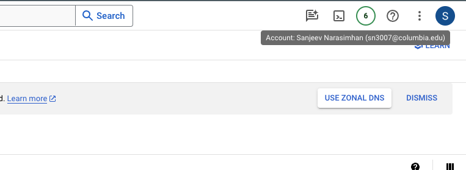
#### [Note 4]
VERY IMPORTANT - Switch off any machines that are not in use! **You will be charged every hour that the instance is active.** The rate depends on the machine configuration chosen. **You will also be charged
for any disks that are created at the end of the month** (usually the charge for disks is much less than running an instance, but if you run out of credits and have active disks, you will still get charged to your card).

Any issues with billing/accidental charges need to be handled with Google Cloud support directly.

## Steps
1. Go to the Google cloud console (https://cloud.google.com/) and sign in with your LionMail account (yourUNI@columbia.edu).

**If you sign up with some other account, you will not be able to use google coupons provided by instructors.**


2. If you are a new user of Google cloud, you can get $300 credits for free by clicking 'Get started for free'. If you already have used GCP, you can skip this step.
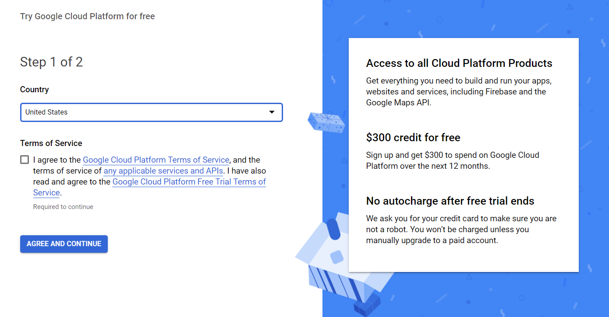

You can explore the GCP for a while with free credits. After the add/drop period, students will get educational coupons from instructors to cover course-related google cloud expenses.

3. Redeem your educational Google Cloud coupons (Google Cloud coupon distribution method TBD). Charges for using a GPU can be approximately $1/hour - so please manage your computational resources wisely.

4. Go to the dropdown at the top to create a new project:
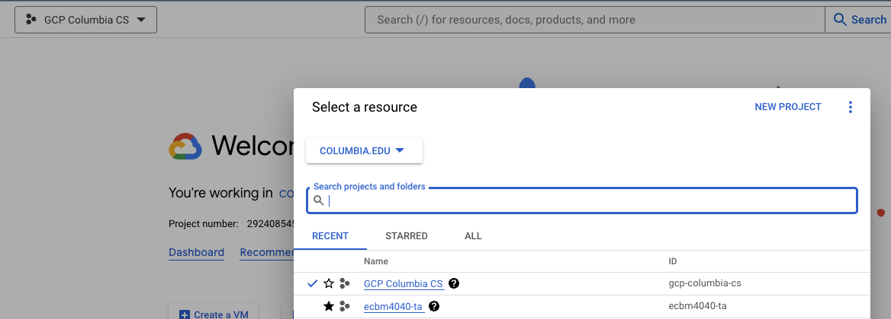

6. Fill in the details to create your project. **Set the billing account to 'Billing account for Education' to use your credits for this project.**
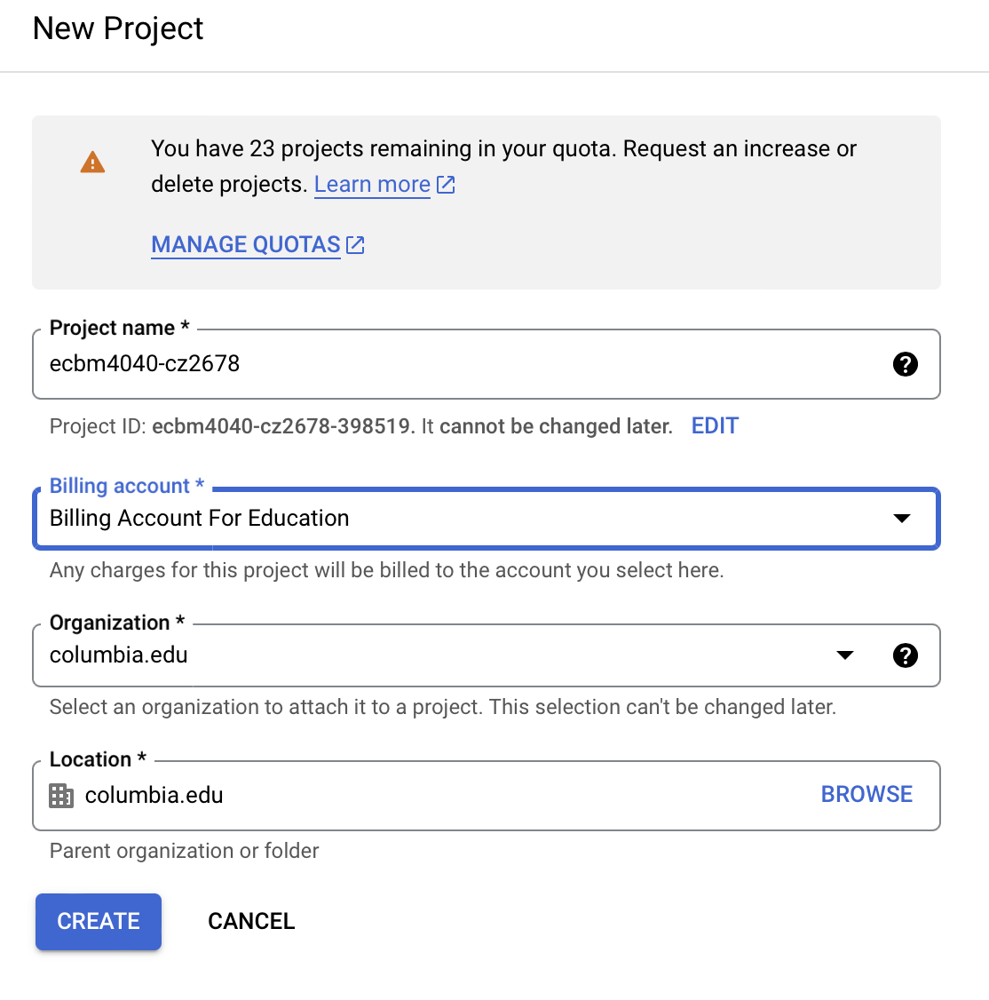

7. Go to "Compute Engine" -> "VM instances" and enable the API.
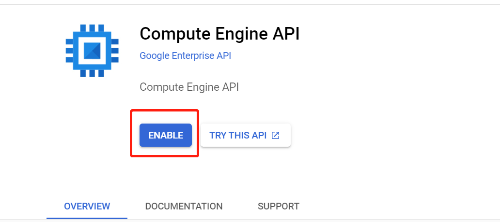


8. **Manage Quotas**:
   - Go to the "IAM & Admin" -> "Quotas"
   - Filter for "Quota : NVIDIA T4 GPUs (default)". Check if the quota is at least 1
   
   

   - Select the region in which you wish to create your instance as is illustrated below. Edit the quota and set it to 1 (You can request an increase later if you need more GPUs, but we recommend starting with 1).
   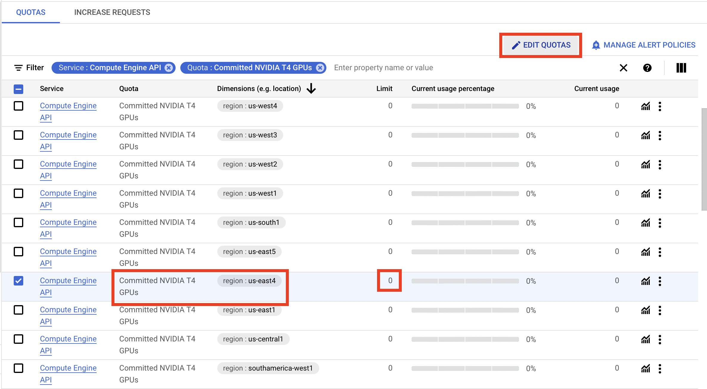

   - Wait for a moment to let Google process your request.
    You should receive an e-mail from Google informing you that they received the request. You will receive another e-mail after your quota request is approved.
    Note that the quota editing request waiting period might vary from minutes to a few hours to 4 days or even longer, depending on the general quota demand. Typically, it takes longer for Google to process the requests at the end of the semester. Please be aware of that fact and manage your time for project experiments at the end of semester properly.

9. Create a GCP VM Instance
   - Go to "Compute Engine" -> "VM instances" and click "Create Instance" at the top.
   - You will need to select a machine configuration. The recommended configuration is provided in the screenshot below. Make sure the zone is the same that you requested a Quota increase, else you will get an error message.
   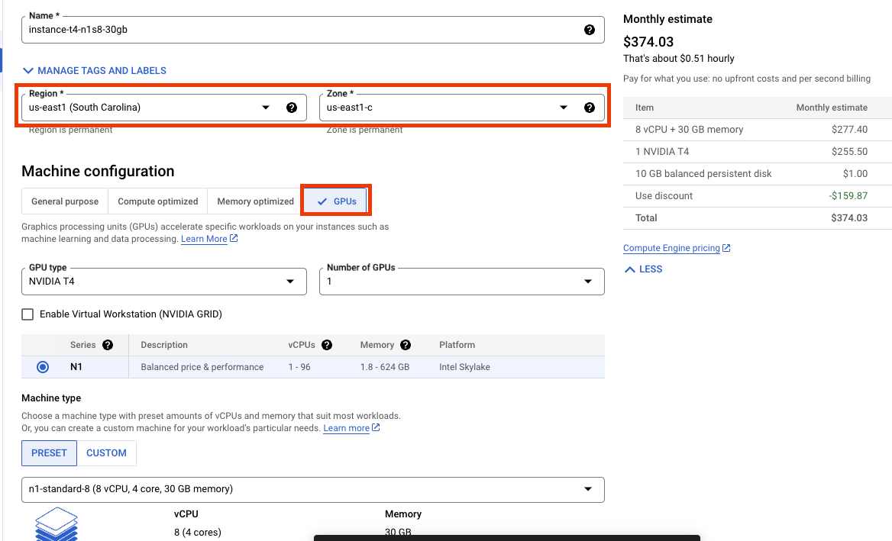
 
   - Note that a T4 gpu is not a particularly powerful GPU, so dealing with large models/datasets might require better GPUs. For all other GPUs, you need to repeat the previous step to grant quotas for that specific GPU E.g. V100, and the same GPU in the relevant zone.
   **Higher GPUs are likely far more expensive**, so plan accordingly.

   - Scroll down to the boot disk section. Select switch image:
   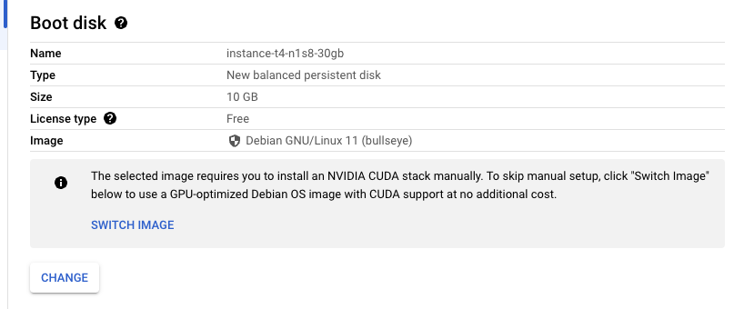

   - Select "Deep Learning on Linux" as the OS, with the CUDA/Python stack as shown below. If you wish, you can select a higher version of CUDA/python based on your project needs.
   
   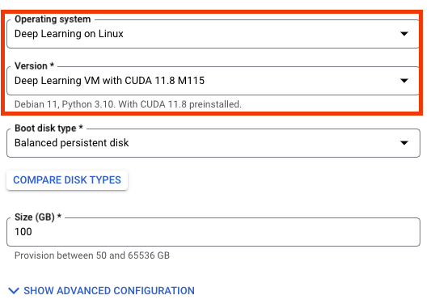

   This saves a lot of time by providing an image with the necessary development stack (CUDA/Python/Anaconda) pre-loaded for GPU-based Deep Learning.

   - You can modify the disk space as necessary, but keep in mind that it will increase the cost of your machine. It is also possible to adjust the disk space at any point later by editing the machine.

   - In the firewall settings, allow both HTTP and HTTPS traffic.
   

   - Click Create.

10. Your machine should be available and running after a couple minutes. **Note that it is possible to get the "resource unavailable" error, which means that you will have to try after some time or in a different region.**


11. Google Cloud SDK - follow the instructions at [https://cloud.google.com/sdk/docs/install] to install the gcloud command line tools. This means you can SSH (connect) from your local system to the GCP instance.
For Windows users, you can use [https://putty.org/](PuTTY); MacOS users can use the default Terminal application.

Note - an alternative is to use the in-browser ssh by clicking the "SSH" button next to the machine. However, this is not recommended as the connection through the in-browser ssh may not be stable and can frequently drop.

11. After installing the gcloud command line tools, you will be prompted through the setup process where you can select your project/region/zone. Run `which gcloud` in your console to verify it is installed correctly -


12. Go back to your GCP VM Instance dashboard. Next to the "SSH" button, you should see a small arrow. Click it and select "View gcloud command".

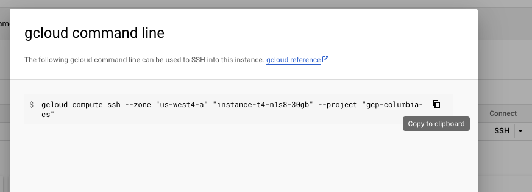

13. Paste this command in your console to connect to your instance. As soon as you connect, you will be prompted to install the NVIDIA drivers. Enter "y" to install the drivers:
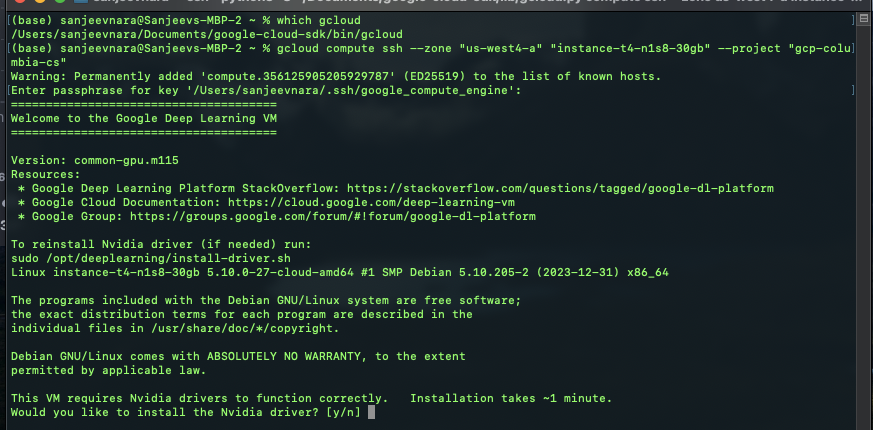

Note: You can reinstall the drivers at any point later when you boot up the machine if there was some issue. As soon as you connect to the machine, you will get instructions on how to do so:


14. Your instance is ready! Note that you already have the Anaconda package manager pre-installed, with the base environment active. You can use this environment, or create a new one:
`conda create -n pytorch-dev python=3.10`

Activate this new environment with `conda activate pytorch-dev`
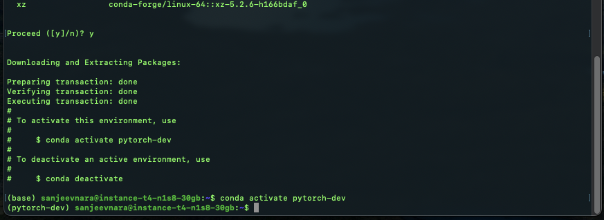

15. Install PyTorch

The most important step to setup your development environment is to install PyTorch.

[Important] We always recommend installing a previous version of PyTorch with precompiled CUDA binaries from [https://pytorch.org/get-started/previous-versions/]. This is because there are sometimes version issues with CUDA when simply running
`pip install torch`. 
  - In this case, we have used CUDA 11.8, so we will use the corresponding version of PyTorch
    ```
    # CUDA 11.8
    pip install torch==2.1.1 torchvision==0.16.1 torchaudio==2.1.1 --index-url https://download.pytorch.org/whl/cu118
    ```
  - Installation may take several minutes. You can scroll through TikTok while you wait.
  - Once installed, you should test pytorch and check if it using the GPU. Run the following commands in python interactive mode:
  ```
  (pytorch-dev) sanjeevnara@instance-t4-n1s8-30gb:~$ python -i
  >>> import torch
  >>> torch.cuda.is_available()
  True
  >>> exit()
  ```

16. Install Jupyter
  - Run `pip install jupyter` to install the latest version of Jupyter Notebook/Lab.
  - Create a jupyter notebook configuration file by running
  `jupyter notebook --generate-config`

  - Open that configuration file:
  `nano ~/.jupyter/jupyter_notebook_config.py`

  - Add the following lines to the top of the configuration file:
  ```
  c = get_config()
  c.NotebookApp.ip = '*'
  c.NotebookApp.open_browser = False
  c.NotebookApp.port = 9999      # or other port number
  ```
  - Once done, run `jupyter notebook` to start your jupyter server. Copy the generated token, which will be required later for authentication.

  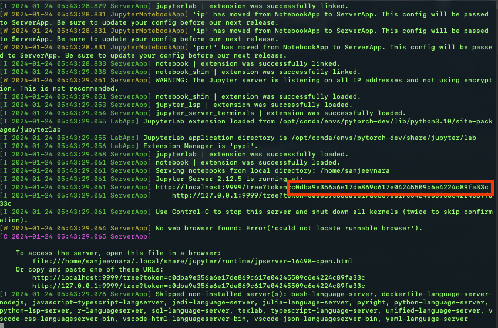


17. Open Jupyter Noteboook by configuring a firewall from the GCP dashboard
  - In GCP, go to 'VPC network'->'Firewall'
  - Create a firewall rule with any name you like, with the configuration below:
  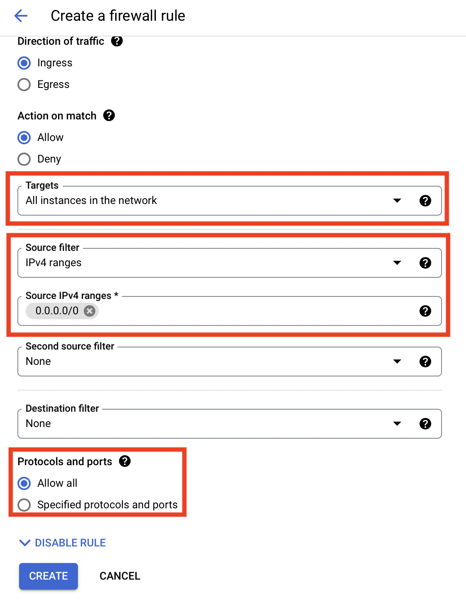
  - Navigate back to your VM instances page on the GCP. Your instance will have an External IP address - copy that IP address (yourExternalIP)
  - Go to a new tab in a browser on your laptop. Type http://yourExternalIP:9999. You should be directed to your Jupyter Notebook. Enter your authentication token.
  - That's it! You can now use jupyter notebooks on your machine:


  
  - You can drag and drop notebooks from your local machine to this screen.
  
18. [Important] Switch off the machine when not in use. This will prevent your credits from being consumed.


#### For any other questions or issues, please contact the E6691 teaching staff.
